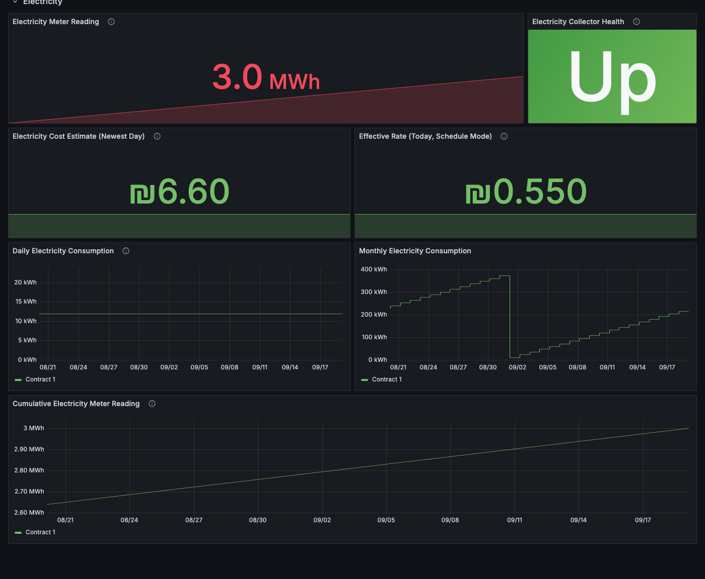

# israel-utility-exporter

[](https://github.com/Aransh/israel-utility-exporter/actions/workflows/build.yml)
[](https://hub.docker.com/r/aransh/israel-utility-exporter)
[](LICENSE)

A [Prometheus](https://prometheus.io) exporter for Israeli household water
([Read Your Meter Pro](https://rym-pro.com), ARAD meters) and electricity
([IEC](https://www.iec.co.il)) consumption data — with a ready-to-use Grafana
dashboard and Prometheus alert rules included.

Unofficial, and not affiliated with Arad Group, any water corporation, the
Israel Electric Company, Prometheus or Grafana Labs.

## Why this exists

Two excellent Homebridge plugins already read this data —
[homebridge-read-your-meter-pro](https://github.com/Aransh/homebridge-read-your-meter-pro)
(water) and
[homebridge-iec-electricity](https://github.com/shayshahar/homebridge-iec-electricity)
(electricity) — but HomeKit has no concept of history: you get today's
number in the Home app and nothing else. This exporter polls the same two
APIs and puts the data in Prometheus instead, so Grafana can show you what
Home never could: **usage over weeks and months, cost trends, and alerts on
your own terms.**

Both collectors are independently optional — run this with just water, just
electricity, or both.

## Quick start

```bash
git clone https://github.com/Aransh/israel-utility-exporter.git
cd israel-utility-exporter
# edit docker-compose.yml: under the israel-utility-exporter service's
# `environment:`, enable water and/or electricity and fill in credentials
docker compose up -d
```

This starts three containers: the exporter, Prometheus (pre-loaded with the
alert rules in `prometheus/alerts.yml`), and Grafana (pre-provisioned with the
dashboard in `grafana/provisioning/dashboards/files/dashboard.json`). Open
Grafana at http://localhost:3000 (default login `admin` / `admin`) — the
"Israel Utility Exporter" dashboard is already there.

If you only want the exporter itself (bring your own Prometheus/Grafana):

```bash
docker run -d --name israel-utility-exporter \
  -p 9877:9877 \
  -v israel-utility-exporter-data:/data \
  -e WATER_ENABLED=true \
  -e WATER_EMAIL=you@example.com \
  -e WATER_PASSWORD='your-portal-password' \
  aransh/israel-utility-exporter:latest
```

Then point Prometheus at it — see `prometheus/prometheus.yml.example` and
`prometheus/alerts.yml`.

## Setting up each collector

### Water (Read Your Meter Pro)

Needs an account at [rym-pro.com](https://rym-pro.com) — registration fails if
your meter isn't an ARAD unit or your water corporation hasn't migrated to the
Pro portal; verify you can log in on the web first. Set:

```
WATER_ENABLED=true
WATER_EMAIL=you@example.com
WATER_PASSWORD=your-portal-password
```

That's it — no further setup. The exporter logs in on startup and keeps the
session token in `DATA_DIR`.

### Electricity (IEC)

IEC login needs your Israeli ID and an SMS/email OTP, which can't be entered
inside an unattended container. It's a one-time (well, occasional) manual
step:

```bash
docker run --rm -it -v israel-utility-exporter-data:/data \
  aransh/israel-utility-exporter node dist/electricity/login-cli.js --id 123456789
```

This prompts for the OTP code, then writes a refresh-capable token into the
same volume the main container reads from. The prompt names the channel Okta
reports (`sms`, `email`, ...) for the factor it actually requested — if that
ever disagrees with where the code really arrived, rerun with
`LOG_LEVEL=debug` for a line listing every available factor plus a warning if
Okta's own responses disagree with each other. Set:

```
ELECTRICITY_ENABLED=true
ELECTRICITY_ID=123456789
```

Then start (or restart) the exporter — it loads and automatically refreshes
that token from then on. `israel_utility_electricity_token_expires_timestamp_seconds`
and the `ElectricityTokenExpiringSoon` alert give warning before the refresh
token itself eventually needs a fresh login (IEC's own refresh tokens are
long-lived, but not eternal).

## Configuration

At least one of `WATER_ENABLED` / `ELECTRICITY_ENABLED` must be `true` — the
exporter exits immediately with an error otherwise rather than serving an
empty `/metrics` silently.

| Variable | Default | Notes |
| --- | --- | --- |
| `PORT` | `9877` | HTTP port for `/metrics` and `/healthz`. |
| `DATA_DIR` | `/data` | Where session/token state is persisted. Mount a volume here. |
| `LOG_LEVEL` | `info` | `debug` \| `info` \| `warn` \| `error`. |
| `WEB_CONFIG_FILE` | — | Path to a YAML file enabling TLS and/or Basic Auth. See [TLS & Basic Auth](#tls--basic-auth) below. |
| `WATER_ENABLED` | `false` | Set `true` to enable the water collector. |
| `WATER_EMAIL` / `WATER_PASSWORD` | — | RYM Pro portal credentials. Required if `WATER_ENABLED`. |
| `WATER_POLL_INTERVAL_MINUTES` | `90` | Floored at 15 — the meter itself updates at most hourly, and polling faster risks the portal's rate limit. |
| `WATER_WEEKLY_WINDOW` | `sunday` | `sunday` \| `monday` \| `rolling` — see [Behavior worth knowing](#behavior-worth-knowing). |
| `WATER_TARIFF_MODE` | `flat` | `flat` \| `tiered`. See [Cost estimation](#cost-estimation). |
| `WATER_PRICE_PER_CUBIC_METER` | — | ILS. Used when `flat`; also the tiered mode's below-allowance rate. If set (flat) or fully configured (tiered), enables `israel_utility_water_cost_estimate_ils`. |
| `WATER_TARIFF_EXCESS_PRICE_PER_CUBIC_METER` | — | ILS. Used when `tiered` — the rate above the household's allowance. |
| `WATER_TARIFF_HOUSEHOLD_SIZE` | — | Positive integer. Used when `tiered` — number of people registered on the water account. Treated as at least 2 — see [Cost estimation](#cost-estimation). |
| `WATER_TARIFF_ALLOWANCE_PER_PERSON_CUBIC_METERS` | — | m3/person/**month**. Used when `tiered`. Published tariffs often quote this per *two months* instead — see [Cost estimation](#cost-estimation) before copying a number straight off a tariff page. |
| `ELECTRICITY_ENABLED` | `false` | Set `true` to enable the electricity collector. |
| `ELECTRICITY_ID` | — | Your 9-digit Israeli ID. Required if `ELECTRICITY_ENABLED`. |
| `ELECTRICITY_TOKEN_FILE` | `$DATA_DIR/iec-token.json` | Written by the login CLI; loaded/refreshed by the collector. |
| `ELECTRICITY_POLL_INTERVAL_MINUTES` | `60` | IEC's own data lags 1-2 days regardless of poll frequency — see below. |
| `ELECTRICITY_TARIFF_MODE` | `flat` | `flat` \| `schedule`. See [Cost estimation](#cost-estimation). |
| `ELECTRICITY_PRICE_PER_KWH` | — | ILS. Used when `flat`. |
| `ELECTRICITY_TARIFF_SCHEDULE_FILE` | — | Path to a JSON schedule file. Used when `schedule`. See `tariff-schedule.example.json`. |
| `REMOTE_WRITE_URL` | — | A Prometheus remote_write endpoint. Only used by the [backfill CLI](#historical-data-backfill), not the running exporter. |
| `REMOTE_WRITE_EXTRA_LABELS` | — | Comma-separated `key=value` pairs (e.g. `job=israel-utility-exporter,instance=host:9877`) applied to every backfilled series — **set this to match your scrape config's `job`/`instance`**, or backfilled and live-scraped data land as separate series. |
| `REMOTE_WRITE_USERNAME` / `REMOTE_WRITE_PASSWORD` | — | HTTP Basic auth for `REMOTE_WRITE_URL`. Set together. |
| `REMOTE_WRITE_BEARER_TOKEN` | — | Bearer token auth for `REMOTE_WRITE_URL`. Mutually exclusive with Basic auth. |
| `REMOTE_WRITE_TIMEOUT_MS` | `30000` | Per-request timeout for the remote_write POST. |
| `REMOTE_WRITE_TLS_CA_FILE` | — | Path to a custom CA bundle (PEM), for a receiver with a private/self-signed certificate. |
| `REMOTE_WRITE_TLS_CERT_FILE` / `REMOTE_WRITE_TLS_KEY_FILE` | — | Client certificate/key (PEM) for mTLS. Set together. |
| `REMOTE_WRITE_TLS_INSECURE_SKIP_VERIFY` | `false` | Disables certificate verification. Testing/self-signed use only — never for production. |

## TLS & Basic Auth

By default the exporter serves plain, unauthenticated HTTP — fine on a
private network, but this data is personal, so set `WEB_CONFIG_FILE` if
`/metrics` is reachable beyond that. Copy `web-config.yml.example` to
`web-config.yml`, fill in what applies, and point `WEB_CONFIG_FILE` at it
(e.g. `/data/web-config.yml`):

```yaml
tls_server_config:
  cert_file: /data/tls/fullchain.pem
  key_file: /data/tls/privkey.pem
basic_auth_users:
  admin: $2y$10$replace-with-a-real-bcrypt-hash
```

Both sections are optional and independent. Passwords are bcrypt hashes, not
plaintext — generate one with `htpasswd -nBC 10 "" | tr -d ':\n'`. `/healthz`
is always served unauthenticated, but still over whatever scheme `/metrics`
uses; `/metrics` and `/` are protected when configured. The exporter reads
the config file and cert/key once at startup — restart it after rotating
certs or changing the file.

Enabling TLS means the image's own `HEALTHCHECK` (plain HTTP) no longer
matches — override it in your own compose file or `docker run`, e.g.
`wget --quiet --tries=1 --spider --no-check-certificate https://localhost:$PORT/healthz`.

## Cost estimation

Both collectors can turn consumption into an estimated cost — entirely
optional, and off by default. Israel doesn't publish tariffs via any API, so
you supply the price yourself:

- **Flat pricing** (`WATER_PRICE_PER_CUBIC_METER`, `ELECTRICITY_PRICE_PER_KWH`):
  one price × the consumption figure. The right choice if you're not on a
  time-of-use electricity plan, or want a simple average.
- **Time-of-use schedule** (electricity only, `ELECTRICITY_TARIFF_MODE=schedule`):
  models Israeli "taoz" plans like "70% off 17:00-23:00" offered by several
  private electricity suppliers. See `tariff-schedule.example.json`:

  ```json
  {
    "baseRatePerKwh": 0.6115,
    "windows": [
      { "days": ["sun", "mon", "tue", "wed", "thu"], "start": "17:00", "end": "23:00", "discountPercent": 70 },
      { "days": ["fri", "sat"], "start": "00:00", "end": "23:59", "discountPercent": 20 }
    ]
  }
  ```

  **Read this before trusting the number it produces.** IEC's own API never
  reports consumption finer than a whole published day's total kWh — there is
  no hourly breakdown to attribute to specific tariff windows (confirmed
  against `py-iec-api`'s and the Home Assistant IEC integration's source: they
  synthesize 24 even hourly buckets from a daily/monthly total when finer data
  is missing, rather than having real per-hour readings — see
  `THIRD-PARTY-NOTICES.md`). So instead of pretending to know when in the day
  you used electricity, the exporter computes a **duration-weighted blended
  rate for that calendar day** — e.g. 6 discounted hours + 18 base hours,
  averaged — and multiplies the day's total kWh by that single number. This
  assumes consumption is roughly even across the day. It is a genuinely useful
  estimate for comparing plans or tracking a trend, but it is **not a bill
  reconstruction** — expect it to diverge from your actual invoice, more so the
  more your usage is concentrated in or out of the discount window.
  `israel_utility_electricity_effective_rate_ils_per_kwh` exposes the blended
  rate itself, so the assumption is visible rather than hidden inside a cost
  figure.
- **Volume-tiered pricing** (water only, `WATER_TARIFF_MODE=tiered`): water
  has no time-of-use concept in Israel — tariffs are volume-tiered instead, a
  subsidized allowance per person registered on the account, then a higher
  rate beyond it (see e.g. a local water corporation's published tariffs,
  like [Yuval Lim's](https://www.yuvallim.co.il/תעריפי-מים-וביוב/)). Configure:
  - `WATER_PRICE_PER_CUBIC_METER` — the rate below the allowance (the same
    variable flat mode uses).
  - `WATER_TARIFF_EXCESS_PRICE_PER_CUBIC_METER` — the rate above it.
  - `WATER_TARIFF_HOUSEHOLD_SIZE` — people registered on the account.
  - `WATER_TARIFF_ALLOWANCE_PER_PERSON_CUBIC_METERS` — m3/person/month before
    the excess rate kicks in.

  This month's threshold is `max(WATER_TARIFF_HOUSEHOLD_SIZE, 2) x
  WATER_TARIFF_ALLOWANCE_PER_PERSON_CUBIC_METERS` — Israeli water tariffs
  guarantee every housing unit at least a 2-person allowance regardless of
  how few people are registered there, so a solo resident isn't shortchanged
  (this floor is fixed by law, not a separate variable). Consumption up to
  the threshold is priced at the normal rate, the rest at the excess rate.
  `israel_utility_water_tariff_threshold_cubic_meters` and
  `israel_utility_water_effective_rate_ils_per_cubic_meter` expose the
  threshold and the resulting blended ILS/m3 rate, so — as with electricity's
  schedule mode — neither is hidden inside the cost figure.
  `israel_utility_water_tariff_normal_rate_ils_per_cubic_meter` also exposes
  the configured below-allowance rate itself, so a dashboard can flag once
  the blended rate has crept above it, without hardcoding your rate into the
  dashboard.

  **Get the actual numbers from your own water corporation's published
  tariff and account details** — they change periodically and this exporter
  doesn't fetch them. Watch the units: `WATER_TARIFF_ALLOWANCE_PER_PERSON_CUBIC_METERS`
  is m3/person **per month** (matching `israel_utility_water_consumption_monthly_liters`),
  but published tariffs often quote it per **two months** instead — e.g.
  Yuval Lim's page says "עד 7 מ"ק לנפש **לחודשיים**" (up to 7 m3/person per
  two months) right next to "3.5 מ״ק **לחודש**" (3.5 m3/month) for the same
  allowance; use the monthly figure (`3.5`), not the bimonthly one (`7`), or
  you'll double the real threshold. A worked example matching that same
  page: `WATER_PRICE_PER_CUBIC_METER=8.51`,
  `WATER_TARIFF_EXCESS_PRICE_PER_CUBIC_METER=15.62`,
  `WATER_TARIFF_ALLOWANCE_PER_PERSON_CUBIC_METERS=3.5`. Also note this is
  still a calendar-month approximation of a tariff actually billed over a
  2-month cycle — usage concentrated near a bimonthly cycle boundary (e.g.
  low one calendar month, high the next) can price slightly differently
  than the real bill, which averages allowance use across the full 2-month
  period rather than resetting it every calendar month.

## Metrics

Namespace `israel_utility`. All gauges; a poll that fails or finds nothing new
published simply leaves them at their last value (Prometheus keeps serving
it), so a portal outage never shows up as a false zero.

Follows Prometheus's official [metric naming](https://prometheus.io/docs/practices/naming/)
and [exporter](https://prometheus.io/docs/instrumenting/writing_exporters/)
conventions — base units, a `build_info` metric, gauges rather than counters
for absolute readings from an external API — and CI runs `promtool check
metrics` against a live `/metrics` response on every push to keep the
exposition format itself verified by Prometheus's own tooling.

**Water** (labels `meter_id`, `meter_serial`):

| Metric | Meaning |
| --- | --- |
| `israel_utility_water_meter_reading_cubic_meters` | Cumulative meter reading. |
| `israel_utility_water_consumption_daily_liters` | Consumption for the most recently published day. |
| `israel_utility_water_consumption_daily_covers_timestamp_seconds` | Which calendar day that is — see the publish-lag note below. |
| `israel_utility_water_consumption_weekly_liters` | Consumption over the configured weekly window. |
| `israel_utility_water_consumption_weekly_days_counted` / `..._elapsed` | How much of the weekly window is actually published vs. begun. |
| `israel_utility_water_consumption_monthly_liters` | Month-to-date consumption. |
| `israel_utility_water_consumption_forecast_liters` | The portal's own month-end forecast. |
| `israel_utility_water_tariff_threshold_cubic_meters` | This month's subsidized-rate threshold. Tiered tariff mode only. |
| `israel_utility_water_effective_rate_ils_per_cubic_meter` | This month-to-date consumption's blended ILS/m3 rate. Tiered tariff mode only. |
| `israel_utility_water_tariff_normal_rate_ils_per_cubic_meter` | The configured below-allowance rate itself, for comparison against the effective rate above. Tiered tariff mode only. |
| `israel_utility_water_cost_estimate_ils` | Month-to-date cost, if priced (flat or tiered). |
| `israel_utility_water_cost_estimate_forecast_ils` | Estimated cost of the portal's own month-end forecast, priced the same way. |
| `israel_utility_water_cost_estimate_previous_month_ils` | Last calendar month's final cost, priced the same way (today's tariff, not necessarily last month's). Not backfilled — live collector only. |
| `israel_utility_water_meter_info` | Always 1; carries `meter_serial` for dashboard joins. |
| `israel_utility_water_scrape_success` / `..._last_success_timestamp_seconds` / `..._consecutive_failures` | Collector health. |

**Electricity** (label `contract_id`):

| Metric | Meaning |
| --- | --- |
| `israel_utility_electricity_meter_reading_kwh` | Cumulative meter reading. |
| `israel_utility_electricity_consumption_daily_kwh` | Consumption for the most recently published day. |
| `israel_utility_electricity_consumption_daily_covers_timestamp_seconds` | Which calendar day that is. |
| `israel_utility_electricity_consumption_monthly_kwh` | Month-to-date consumption. |
| `israel_utility_electricity_effective_rate_ils_per_kwh` | Today's blended rate — schedule tariff mode only. |
| `israel_utility_electricity_cost_estimate_ils` | Estimated cost of the newest published day, if priced. |
| `israel_utility_electricity_cost_estimate_monthly_ils` | Month-to-date cost, if priced — each published day priced at its own rate and summed. |
| `israel_utility_electricity_cost_estimate_previous_month_ils` | Last calendar month's final cost, priced the same way (today's tariff, not necessarily last month's). Not backfilled — live collector only. |
| `israel_utility_electricity_token_expires_timestamp_seconds` | When the current session token expires. |
| `israel_utility_electricity_contract_info` | Always 1; carries `contract_number`/`address` for dashboard joins. |
| `israel_utility_electricity_scrape_success` / `..._last_success_timestamp_seconds` / `..._consecutive_failures` | Collector health. |

Plus `israel_utility_exporter_build_info{version="..."}`.

## Grafana dashboard & Prometheus alerts




- `grafana/provisioning/dashboards/files/dashboard.json` — auto-provisioned by
  `docker-compose.yml`, or import it manually into your own Grafana. Two
  rows, Water and Electricity, each showing the cumulative meter trend,
  daily/monthly consumption over time, cost estimate, and collector health —
  a row simply shows "No data" if that collector is disabled. Each row's
  meter-reading panel gets most of the width, since it's the one with a
  sparkline worth seeing; collector health is just an Up/Down badge, so it
  only gets a narrow strip rather than half the row. The water row's
  pricing panels (top screenshot) show month-to-date cost and the
  portal's forecast side by side with a sparkline of the trend, plus the
  effective rate expressed as a percentage of the normal (below-allowance)
  rate — 100% means every m3 so far is priced at the normal rate, and the
  panel background turns orange once the month has spilled into the pricier
  excess tier. Electricity's pricing row (bottom screenshot) is simpler —
  no tiers, so no equivalent rate-vs-normal panel — but its cost estimate
  gets the same sparkline treatment for visual consistency.
- `prometheus/alerts.yml` — two rule groups:
  - **Health alerts** (safe to run as shipped): the exporter being
    unreachable, either collector going stale (no successful poll in 6h) or
    failing repeatedly, and the electricity token nearing expiry.
  - **Budget alert examples** (illustrative thresholds — size them to your
    own household before relying on them): daily/monthly consumption over a
    limit, based on Israel's ~400 L/person/day and ~3.5 m³ (3500 L)/person/month
    subsidized-allocation guidance. `WaterMonthlyConsumptionOverBudget` is the
    exception — in `WATER_TARIFF_MODE=tiered` it compares directly against
    `israel_utility_water_tariff_threshold_cubic_meters`, so it needs no
    manual sizing.

## Behavior worth knowing

- **The daily figure isn't always today's.** Both portals publish a day's
  reading with a lag — sometimes a day or two. Both collectors look back up
  to 7 days and report the newest day actually published, and
  `*_covers_timestamp_seconds` tells you which day that is. A null/unpublished
  reading is never reported as zero consumption.
- **`WATER_WEEKLY_WINDOW=rolling` vs. `sunday`/`monday`**: the calendar-week
  options reset on that weekday (so early in a new week the total is small
  because little has been published yet, not because usage was low); `rolling`
  is the trailing 7 days and never resets, so a threshold on it means the same
  thing every day.
- **Electricity data is inherently coarse.** IEC updates meter data roughly
  every 1-2 days regardless of how often you poll — `ELECTRICITY_POLL_INTERVAL_MINUTES`
  below ~60 gains nothing.
- **Prometheus's `scrape_interval` is a different knob from either poll
  interval above, and it has its own constraint that's unrelated to how
  slowly the underlying data changes.** Prometheus's query engine only finds
  a series if its newest sample is within `--query.lookback-delta` (default
  5m) of the time being evaluated — older than that, and it's treated as
  absent, even though the exporter would report the exact same value on the
  next scrape. So `scrape_interval` must stay comfortably below 5m (the
  default), or "current value" Stat panels can render as no-data/unconfigured
  depending on exactly when they're queried — regardless of how rarely the
  water/electricity poll cadence itself actually updates a value. Scraping
  `/metrics` just reads an in-memory number, so it's nearly free; if you
  deliberately want a slower `scrape_interval` anyway, raise Prometheus's
  own `--query.lookback-delta` startup flag to comfortably exceed it instead
  (that flag is global, so it also widens the blind spot for detecting a
  genuinely dead target on every other job on that Prometheus).
- **A rejected water password stops that collector, not the exporter.**
  Retrying a bad password on a timer risks the portal's login lockout, so it
  logs an error and stops polling water — fix `WATER_EMAIL`/`WATER_PASSWORD`
  and restart. Electricity works the same way for an unrecoverable token: it
  reports the problem and waits for you to re-run the login CLI, rather than
  crash-looping the whole container.
- **Everything else (rate limits, transient errors) holds the last known
  reading** and keeps retrying on the next poll, rather than showing a gap.

## Historical data backfill

The exporter only ever surfaces the newest published day/week/month (see
above) — data from before either collector's live lookback window, or from
before the exporter was first deployed, is never backfilled automatically.
Run the included CLI once (or whenever there's a gap to fill) to push
historical data directly into your TSDB:

```bash
node dist/backfill-cli.js --service all --days 90
node dist/backfill-cli.js --service electricity --from 2026-01-01 --to 2026-03-01
node dist/backfill-cli.js --service water --days 30 --dry-run   # preview only, no write
```

Running it interactively also asks whether to include **estimated** cumulative
meter readings (see below); pass `--estimated-readings` or
`--no-estimated-readings` to answer that up front instead (required in a
non-interactive/cron context — without one, it defaults to skipping them).

- **Match your scrape config's `job`/`instance` labels, or the graph will split
  in two.** Those labels are assigned by Prometheus itself when it scrapes a
  target — they're not part of `/metrics` — so a backfilled series has no
  `job`/`instance` label unless you add it yourself, making it a *different*
  series from the one your live scrapes produce for the same meter/contract.
  Set `REMOTE_WRITE_EXTRA_LABELS` to whatever your scrape config uses, e.g.
  for the `job_name`/target in `prometheus/prometheus.yml.example`:
  `REMOTE_WRITE_EXTRA_LABELS=job=israel-utility-exporter,instance=israel-utility-exporter:9877`.
- Backfills the **raw numbers the utility APIs report directly** (daily
  consumption for both utilities, weekly consumption for water — electricity
  has no weekly metric — and monthly consumption for both), plus, wherever a
  tariff is configured, the **cost/rate metrics derived from them**
  (`israel_utility_water_cost_estimate_ils`,
  `israel_utility_water_tariff_threshold_cubic_meters`,
  `israel_utility_water_effective_rate_ils_per_cubic_meter`,
  `israel_utility_water_tariff_normal_rate_ils_per_cubic_meter`,
  `israel_utility_electricity_cost_estimate_ils`,
  `israel_utility_electricity_cost_estimate_monthly_ils`,
  `israel_utility_electricity_effective_rate_ils_per_kwh`). Those are priced
  with **today's tariff config**, the same way the live collectors always
  price the current month/day — there's no record of what a historical day's
  rate actually was, so if your tariff (household size, per-m3 rate,
  time-of-use schedule, …) changed since the period you're backfilling, the
  resulting cost/rate samples for that period will reflect the current
  config, not the one that actually applied then. The water forecast metrics
  (`israel_utility_water_consumption_forecast_liters` and
  `israel_utility_water_cost_estimate_forecast_ils`) are never backfilled —
  a forecast is inherently forward-looking and has no historical equivalent.
- **Optionally, the cumulative meter reading can also be backfilled** —
  `israel_utility_water_meter_reading_cubic_meters` and
  `israel_utility_electricity_meter_reading_kwh`. Both walk backward from a
  known reading, subtracting each day's already-fetched consumption, but
  how reliable that known reading is differs by service:
  - **Water** has no historical reading available anywhere in its API, so
    the anchor is today's *live* reading — a **best-effort estimate**, not
    a figure the portal ever reported for a past day.
  - **Electricity** is better than an estimate: IEC's own monthly response
    carries a genuine, dated reading for the requested month (distinct from
    the always-"as of now" figure the live gauge uses), so each month
    reconstructs from its own real historical anchor instead of one guess
    for the whole range.

  Either way, reconstruction stops rather than guessing as soon as it hits
  a day with no published consumption, or would otherwise go negative, so a
  real gap in the portal's history simply limits how far back it can go
  instead of producing wrong values past it. Neither can detect a meter
  swap, a meter reset, or a house move — any of those silently invalidates
  every reconstructed reading from before it happened, so skip this if one
  of those occurred within the range you're backfilling. Because of that,
  it's opt-in: pass `--estimated-readings`, or answer "y" at the
  interactive prompt.
- Monthly consumption is written as a **running month-to-date total, one
  sample per day** — the same thing the live gauge shows if scraped that
  day — not a single point on the 1st carrying the whole month's eventual
  total (which would misrepresent every earlier day, and wouldn't even be
  visible unless the dashboard's time range happens to reach back to that
  exact date, since one point every ~30 days is easy to scroll past).
- The range you can actually backfill is **limited to whatever the underlying
  portal API itself still retains** — there's no way to go back further than
  that, regardless of `--days`/`--from`.
- **Your remote_write receiver needs to be configured to accept historical
  timestamps, or it can silently drop them while still reporting success.**
  Prometheus's own remote-write receiver rejects out-of-order samples by
  default (`--storage.tsdb.out-of-order-time-window` defaults to `0`) — set
  it to cover your backfill range. Other receivers have their own retention/
  backfill-age limits. If a wide backfill looks incomplete, check the
  receiver's own logs/config rather than assuming the CLI missed something.
- Electricity requires a token already saved by `npm run login:electricity` —
  IEC's OTP login can't be automated here.
- Samples are timestamped at **local midnight** of the day they cover, the
  same semantics `*_covers_timestamp_seconds` already uses, so a backfilled
  point lines up with what a live scrape would have reported that day. Water's
  weekly total has no live `covers_timestamp` gauge to imitate, so its
  backfilled sample is timestamped at the **end of that week's bucket**
  instead; a week whose 7-day window extends past the requested `--to` is
  skipped rather than backfilled with a partial total that — unlike the live
  gauge — never gets corrected later.
- Writing uses the standard Prometheus **remote_write** protocol (protobuf +
  Snappy) — the same wire format Prometheus itself sends — so
  `REMOTE_WRITE_URL` can point at any compliant receiver (Prometheus with
  `--web.enable-remote-write-receiver`, Thanos, Cortex, Mimir, or any other
  remote_write-compatible TSDB). remote_write is naturally idempotent —
  writing the same series/timestamp/value again is a safe no-op — so it's
  safe to re-run the CLI over an overlapping range; a differing value at an
  already-written timestamp is simply rejected by the receiver.
- Without `REMOTE_WRITE_URL` set, only `--dry-run` works (it prints what would
  be sent, without requiring one).

See the [Configuration](#configuration) table for `REMOTE_WRITE_*` variables,
including TLS options (custom CA, client cert, skip-verify) for a receiver on
a private or self-signed certificate.

## Development

```bash
npm install
npm run lint
npm run build
npm test          # lint + build + unit tests, against faked APIs — no real credentials needed
```

Unit tests stub `globalThis.fetch` with fake portal/IEC servers (see
`test/rympro-client.test.ts`, `test/iec-client.test.ts`) rather than hitting
the real APIs.

To verify field names against your own account if something looks wrong, run
with `LOG_LEVEL=debug` — both collectors log the raw shape of every API
response they use at debug level.

See [CONTRIBUTING.md](CONTRIBUTING.md) before opening a pull request.

## Credits

The water and electricity clients are ports of code from
[homebridge-read-your-meter-pro](https://github.com/Aransh/homebridge-read-your-meter-pro)
(same author, MIT) and
[homebridge-iec-electricity](https://github.com/shayshahar/homebridge-iec-electricity)
(Shay Shahar, Apache-2.0) / [py-iec-api](https://github.com/GuyKh/py-iec-api)
(Guy Khmelnitsky, Apache-2.0). Full attribution in
[THIRD-PARTY-NOTICES.md](THIRD-PARTY-NOTICES.md).

## License

MIT
